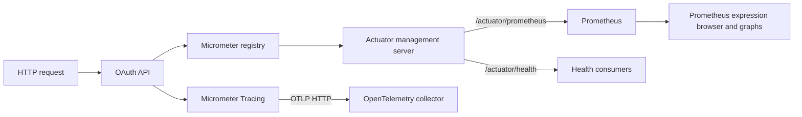

# OAuth API Observability Specification

## 1. Scope

This document describes the observability features implemented by the OAuth API: health checks, application and business metrics, Prometheus scraping, distributed tracing export, and operational verification.

The service uses Spring Boot Actuator, Micrometer, Micrometer Tracing, and the OpenTelemetry OTLP exporter. Prometheus stores and graphs metrics. Grafana is not part of the OAuth service or its required Docker Compose stack.

## 2. Telemetry architecture



The application API and management endpoints listen on separate ports. This keeps health and metric traffic independent from the public API listener.

## 3. Runtime configuration

| Setting | Default | Description |
| --- | --- | --- |
| `spring.application.name` | `oauth-api` | Service identity used by telemetry. |
| `OAUTH_INTERNAL_API_PORT` | `8081` | Application HTTP port inside the container. |
| `OAUTH_INTERNAL_METRICS_PORT` | `9464` | Actuator management port inside the container. |
| `management.endpoints.web.exposure.include` | `health,prometheus,info,metrics` | Exposed Actuator endpoints. |
| `management.endpoint.health.show-details` | `always` | Includes component details in health responses. |
| `management.metrics.tags.application` | `oauth-api` | Common `application` tag added to metrics. |
| `management.tracing.sampling.probability` | `1.0` | Samples every trace in the development configuration. |
| `OTEL_EXPORTER_OTLP_ENDPOINT` | `http://localhost:4318/v1/traces` | OTLP HTTP trace destination. |

When running in Docker, `localhost` refers to the OAuth container. Compose therefore must set `OTEL_EXPORTER_OTLP_ENDPOINT` to the collector's service hostname when a collector is present.

The external management port is determined by the Compose port mapping. Use `docker compose ps` to see the effective host port.

## 4. Actuator endpoints

| Path on the management port | Purpose |
| --- | --- |
| `/actuator/health` | Overall health and registered health component details. |
| `/actuator/prometheus` | Prometheus text exposition endpoint. |
| `/actuator/metrics` | Lists available Micrometer metric names. |
| `/actuator/metrics/{name}` | Displays measurements and tags for one metric. |
| `/actuator/info` | Application information endpoint. |

The application also exposes `GET /health` on the API port as a lightweight service response. It is separate from Actuator health.

## 5. Metric inventory

All metrics receive the common tag `application="oauth-api"`.

### 5.1 Authentication and authorization metrics

| Micrometer name | Prometheus name | Tags | Meaning |
| --- | --- | --- | --- |
| `oauth.logins.total` | `oauth_logins_total` | `status=success` | Successful logins returned by Keycloak. |
| `oauth.validations.total` | `oauth_validations_total` | `status=allowed\|forbidden`, `resource` | Completed resource authorization decisions. |
| `oauth.validations.denied` | `oauth_validations_denied_total` | `reason=missing_header\|missing_resource\|invalid_token\|unauthorized_role` | Requests rejected before or during authorization. |

### 5.2 User metrics

| Micrometer name | Prometheus name | Meaning |
| --- | --- | --- |
| `oauth.users.listed.total` | `oauth_users_listed_total` | Successful user-list operations. |
| `oauth.users.retrieved.total` | `oauth_users_retrieved_total` | Successful user lookups by ID. |
| `oauth.users.created.total` | `oauth_users_total` | Successful user creations. Micrometer normalizes the `created.total` suffix to this Prometheus name. |
| `oauth.users.updated.total` | `oauth_users_updated_total` | Successful user updates. |
| `oauth.users.deleted.total` | `oauth_users_deleted_total` | Successful logical user deletions. |
| `oauth.users.password_updated.total` | `oauth_users_password_updated_total` | Successful password changes. |
| `oauth.users.roles.assigned.total` | `oauth_users_roles_assigned_total` | Successful realm-role assignments. |
| `oauth.users.roles.removed.total` | `oauth_users_roles_removed_total` | Successful realm-role removals. |

### 5.3 Role metrics

| Micrometer name | Prometheus name | Meaning |
| --- | --- | --- |
| `oauth.roles.created.total` | `oauth_roles_total` | Successful realm-role creations. Micrometer normalizes the `created.total` suffix to this Prometheus name. |
| `oauth.roles.listed.total` | `oauth_roles_listed_total` | Successful role-list operations. |
| `oauth.roles.retrieved.total` | `oauth_roles_retrieved_total` | Successful role lookups by ID. |
| `oauth.roles.updated.total` | `oauth_roles_updated_total` | Successful full role updates. |
| `oauth.roles.patched.total` | `oauth_roles_patched_total` | Successful partial role updates. |
| `oauth.roles.deleted.total` | `oauth_roles_deleted_total` | Successful logical role deletions. |

### 5.4 Framework metrics

Spring Boot and Micrometer also expose standard runtime metrics, including:

- `http_server_requests_seconds_*` for request count and latency;
- `jvm_*` for memory, garbage collection, threads, and class loading;
- `process_*` for process CPU and uptime;
- `system_*` for host CPU and load information;
- `logback_events_total` for log events by level.

The exact framework metric set depends on the running JVM and enabled binders. Query `/actuator/metrics` or the Prometheus endpoint instead of assuming that every optional binder is available.

## 6. Prometheus integration

A minimal Prometheus scrape job for the default internal management port is:

```yaml
scrape_configs:
  - job_name: oauth
    metrics_path: /actuator/prometheus
    static_configs:
      - targets:
          - oauth:9464
```

The target name must match the OAuth Compose service name. If Compose overrides `OAUTH_INTERNAL_METRICS_PORT`, the target port must be changed to the same value.

### Useful PromQL queries

Scrape availability:

```promql
up{job="oauth"}
```

HTTP request volume by method, URI, and status:

```promql
sum by (method, uri, status) (
  rate(http_server_requests_seconds_count{application="oauth-api"}[5m])
)
```

Average HTTP latency over five minutes:

```promql
sum by (uri) (rate(http_server_requests_seconds_sum{application="oauth-api"}[5m]))
/
sum by (uri) (rate(http_server_requests_seconds_count{application="oauth-api"}[5m]))
```

Successful login rate:

```promql
sum(rate(oauth_logins_total{application="oauth-api",status="success"}[5m]))
```

Denied validation attempts by reason:

```promql
sum by (reason) (
  increase(oauth_validations_denied_total{application="oauth-api"}[15m])
)
```

Users created during the last hour:

```promql
sum(increase(oauth_users_total{application="oauth-api"}[1h]))
```

Prometheus can display these expressions as tables or time-series graphs in its built-in UI. Persistent dashboards require an additional visualization system such as Grafana.

## 7. Distributed tracing

Micrometer Tracing instruments supported Spring components and exports sampled traces through the OpenTelemetry OTLP HTTP exporter.

For the collector named `otel-collector` in the repository Compose network, the required value is:

```text
OTEL_EXPORTER_OTLP_ENDPOINT=http://otel-collector:4318/v1/traces
```

Trace export requires a reachable OTLP receiver. The repository provisions an OpenTelemetry Collector, but the current OAuth Compose service does not pass `OTEL_EXPORTER_OTLP_ENDPOINT`. Without that override, the container uses `localhost` and cannot reach the collector service. The collector currently uses its debug trace exporter and does not provide persistent trace storage or a trace user interface.

The development sampling probability is `1.0`. Production environments should choose a lower value based on traffic volume, storage cost, and incident-analysis needs.

## 8. Health monitoring

Two health endpoints serve different consumers:

1. `GET /health` on the application port provides a simple API-level response.
2. `GET /actuator/health` on the management port provides Spring health status and component details.

Because `show-details` is set to `always`, the Actuator response can reveal infrastructure details. Restrict access to the management port or change this setting outside the local development environment.

## 9. Verification procedure

1. Start the environment from the repository root:

   ```bash
   docker compose up --build
   ```

2. Find the OAuth API and management port mappings:

   ```bash
   docker compose ps
   ```

3. Check application health on the mapped API port:

   ```bash
   curl http://localhost:8181/health
   ```

4. Check Actuator health and metric exposition on the mapped management port:

   ```bash
   curl http://localhost:<management-port>/actuator/health
   curl http://localhost:<management-port>/actuator/prometheus
   ```

5. Open Prometheus and confirm that `up{job="oauth"}` returns `1` for the OAuth target.

6. Exercise `/login`, `/users`, and `/roles`, then query the corresponding counters.

7. If tracing infrastructure is configured, confirm that the collector receives spans carrying the service name `oauth-api`.

## 10. Test coverage

The repository includes controller, service, configuration, and exception-handler tests. The `e2e` Maven profile runs the application against the Docker Compose Keycloak instance and verifies invalid login, user and role lifecycle operations, role assignment and removal, logical deletions, and email validation.

Run all regular tests:

```bash
mvn test
```

Run the automated end-to-end flow on Windows:

```powershell
.\scripts\run-e2e.ps1
```

## 11. Operational limitations

- Prometheus stores metrics and provides basic graphing, but this project does not provision Grafana dashboards.
- The root Compose stack includes an OTLP collector, but the OAuth service must receive `OTEL_EXPORTER_OTLP_ENDPOINT=http://otel-collector:4318/v1/traces` to send traces to it.
- The current collector prints traces through its debug exporter and does not provide a persistent trace backend or trace UI.
- The `resource` tag on authorization metrics originates from the request. Clients should use the documented resource names to avoid unnecessary metric cardinality.
- Business counters record successful controller operations and selected authorization failures. They are not an audit log and do not replace Keycloak event auditing.
- The service currently relies on console logging and does not configure centralized log storage or log shipping.
