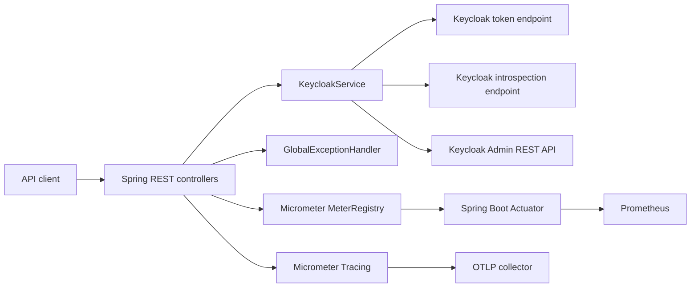

# OAuth API

The OAuth API is the authentication and identity management service for the Construction Software project. It exposes application-oriented endpoints for login, users, realm roles, role assignments, and authorization checks while using Keycloak as the identity provider and source of truth.

The service is implemented with Java 21 and Spring Boot. It does not maintain a local user or role database.

## Architecture



### Main components

| Component | Responsibility |
| --- | --- |
| `AuthController` | Login, token validation, health, and resource authorization endpoints. |
| `UserController` | User creation, retrieval, update, password change, logical deletion, and realm-role mappings. |
| `RoleController` | Realm-role creation, retrieval, update, patch, and logical deletion. |
| `KeycloakService` | Calls Keycloak token, token introspection, and Admin REST endpoints. |
| `GlobalExceptionHandler` | Converts application and Keycloak failures to the required error document. |
| Spring Boot Actuator | Exposes health, metrics, and Prometheus endpoints on the management port. |

### Authentication flow

1. A client sends `username` and `password` as form data to `POST /login`.
2. The API calls the Keycloak token endpoint using the password grant, `client_id`, and `client_secret`.
3. The API returns the token fields required by the assignment contract.

### Protected endpoint flow

1. The client sends `Authorization: Bearer {access_token}`.
2. The API introspects the token in Keycloak and requires `active=true`.
3. The same caller token is used for Keycloak Admin REST requests.
4. Keycloak evaluates whether the caller has permission to perform the requested administration operation.

### Authorization flow

`/validate` and `/authorize` are aliases. Both accept `GET` with a `resource` query parameter or `POST` with a JSON body, validate the token, and check the roles in the token against the resource matrix maintained by the API:

| Role | Resources |
| --- | --- |
| `administrator` | `resources`, `rooms`, `professors`, `students` |
| `coordinator` | `courses`, `classes` |
| `professor` | `lessons`, `reservations` |
| `student` | No resource permission configured |

Users and realm roles are stored in Keycloak. User deletion is logical and sets `enabled=false`. Role deletion is also logical and sets the custom role attribute `enabled=false`; Keycloak does not provide a native enabled flag for roles. This custom role flag does not remove existing role mappings by itself.

## Running with Docker Compose

From the repository root:

```bash
docker compose up --build
```

The local development environment normally exposes:

| Service | URL |
| --- | --- |
| OAuth API | `http://localhost:8181` |
| Swagger UI | `http://localhost:8181/swagger-ui/index.html` |
| OpenAPI document | `http://localhost:8181/v3/api-docs` |
| OAuth Actuator and metrics | `http://localhost:8381/actuator` |
| Prometheus | `http://localhost:9090` |
| Keycloak | `http://localhost:8081` |

The API port and management port can be changed by the Compose environment. Check the effective mappings with:

```bash
docker compose ps
```

## Configuration

| Environment variable | Application default | Purpose |
| --- | --- | --- |
| `OAUTH_INTERNAL_API_PORT` | `8081` | HTTP port inside the OAuth container. |
| `OAUTH_INTERNAL_METRICS_PORT` | `9464` | Actuator management port inside the container. |
| `KEYCLOAK_SERVER_URL` | `http://localhost:8080` | Keycloak base URL. Compose must use the Keycloak service address. |
| `KEYCLOAK_REALM` | `constrsw` | Keycloak realm. |
| `KEYCLOAK_CLIENT_ID` | `oauth` | Confidential client used by the API. |
| `KEYCLOAK_CLIENT_SECRET` | Development value in `application.yml` | Keycloak client secret. Override it outside local development. |
| `OTEL_EXPORTER_OTLP_ENDPOINT` | `http://localhost:4318/v1/traces` | OTLP HTTP trace endpoint. Compose must use the collector service address. |

## API endpoints

### Authentication and authorization

| Method | Path | Description |
| --- | --- | --- |
| `POST` | `/login` | Exchanges form-data credentials for Keycloak tokens. |
| `GET` | `/health` | Lightweight application health response. |
| `GET`, `POST` | `/validate` | Validates a token and checks access to a resource. |
| `GET`, `POST` | `/authorize` | Alias for the same token and resource authorization check. |

### Users

All user endpoints require a bearer access token.

| Method | Path | Description |
| --- | --- | --- |
| `POST` | `/users` | Creates a user. The returned ID is extracted from Keycloak's `Location` header. |
| `GET` | `/users` | Lists users; accepts `enabled=true` or `enabled=false`. |
| `GET` | `/users/{id}` | Retrieves a user by ID. |
| `PUT` | `/users/{id}` | Updates the supplied user attributes. |
| `PATCH` | `/users/{id}` | Changes the user's password. |
| `DELETE` | `/users/{id}` | Logically deletes a user by disabling it. |
| `POST` | `/users/{id}/roles/{roleId}` | Assigns a realm role to a user. |
| `DELETE` | `/users/{id}/roles/{roleId}` | Removes a realm-role assignment. |

### Roles

All role endpoints require a bearer access token.

| Method | Path | Description |
| --- | --- | --- |
| `POST` | `/roles` | Creates a realm role. |
| `GET` | `/roles` | Lists realm roles. |
| `GET` | `/roles/{id}` | Retrieves a realm role by ID. |
| `PUT` | `/roles/{id}` | Replaces the supplied role attributes. |
| `PATCH` | `/roles/{id}` | Partially updates a role. |
| `DELETE` | `/roles/{id}` | Logically deletes a role by setting its custom `enabled` attribute to `false`. |

## Error responses

Errors use the assignment format:

```json
{
  "error_code": "OA-000",
  "error_description": "Error description",
  "error_source": "OAuthAPI",
  "error_stack": []
}
```

When a Keycloak response is the final cause, its HTTP status is propagated through `error_code`, unless a more specific application rule applies.

## Contract compatibility notes

- The login success response and its OpenAPI schema preserve the assignment spelling `referesh_expires_in`.
- `POST /login` returns `201 Created`, as required by the assignment, even though token endpoints commonly return `200 OK`.
- The assignment lists role CRUD and user-role assignment operations without defining their mandatory response bodies or HTTP status codes. Their current behavior is documented by the generated OpenAPI specification and is not presented here as an assignment requirement.

## Observability

The API exposes health and Prometheus metrics through Spring Boot Actuator on a separate management port and can export traces over OTLP. See [ESPECIFICACAO_OBSERVABILIDADE.md](ESPECIFICACAO_OBSERVABILIDADE.md) for the telemetry architecture, metric inventory, PromQL examples, and verification procedure.

Prometheus includes its own expression browser and graph view. Grafana is not included in this service or in its required Compose stack; it may be connected separately if dashboards are needed.

## Tests

Run the regular test suite from this directory:

```bash
mvn test
```

Run the end-to-end suite against a live Docker Compose environment:

```powershell
.\scripts\run-e2e.ps1
```

The script requires the OAuth and Keycloak Compose services to be running. It builds the test runtime in an isolated Maven container, runs the `e2e` Maven profile, and removes that temporary container when finished. The tests clean up their own Keycloak data. To run the profile manually when all services are already available:

```bash
mvn verify -Pe2e
```

The end-to-end suite covers invalid login, the user and role lifecycle, role assignment and removal, logical deletion, and invalid email rejection.

## Project layout

```text
src/main/java/br/pucrs/constrsw/oauth/
  config/       Spring and OpenAPI configuration
  controller/   HTTP endpoints
  dto/          API request and response documents
  exception/    Error model and exception mapping
  service/      Keycloak REST integration
src/main/resources/
  application.yml
src/test/
  java/         Unit, integration, and end-to-end tests
scripts/
  run-e2e.ps1   Local end-to-end test runner
```
