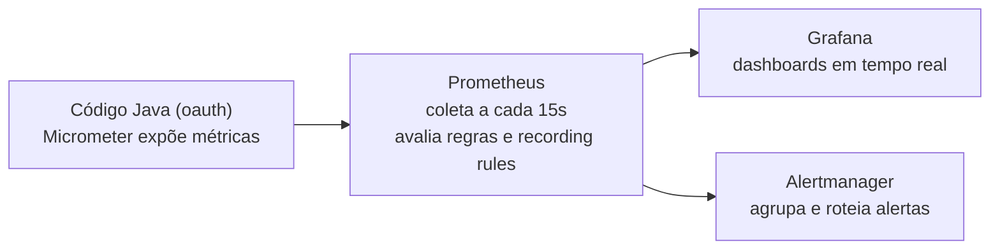

# Contexto Técnico — Observabilidade Avançada (Prometheus, Grafana, Alertmanager) — Grupo 08

> **Data:** 27/09/2026
> **Autor:** Arthur Mendes Maciel
> **Base de Comparação:** estado do microsserviço `oauth` logo após a entrega de telemetria de `CONTEXTO-TELEMETRIA-LUCAS.md` (commit `edd2ec2`)
> **Objetivo:** Registrar o que foi adicionado nesta frente de observabilidade — o quê, de onde veio, e por quê — para a apresentação do trabalho e para os colegas de grupo acompanharem as decisões.

---

## 1. Motivação

O professor sinalizou que explorar mais o Prometheus seria um diferencial do trabalho ("tem coisas legais nele não sendo usadas"). Antes de mexer em qualquer config, levantamos o estado real do projeto — ver seção 2.

O resultado cobre duas frentes que não são excludentes:

1. **Nativo do Prometheus** — regras de alerta ativadas, recording rules, Alertmanager. Nada disso depende do Grafana.
2. **Visualização** — Grafana provisionado do zero, com dashboard pronto. Nenhum outro grupo da turma está usando.

---

## 2. Contexto: o que encontramos antes de mexer

- O `docker-compose.yml` compartilhado da disciplina (raiz do repo `base/`) estava **6 commits atrasado** no clone local — precisou de `git pull` pra trazer Prometheus, Keycloak e rede compartilhados (que passaram a existir há pouco tempo no repositório da turma).
- `backend/oauth/prometheus/prometheus.yml` apontava para `keycloak:9000`, mas a porta real de métricas do Keycloak (definida no `.env` compartilhado, `KC_HTTP_MANAGEMENT_PORT`) é `9001` — o alvo aparecia `down`.
  - Nota histórica: o PR #23 (`CONTEXTO-TELEMETRIA-LUCAS.md`, achado do Copilot) já tinha corrigido esse mesmo target uma vez, para `9000`, que era a porta correta *naquele momento*. A porta voltou a mudar depois, quando o compose compartilhado da raiz evoluiu (`KC_HTTP_MANAGEMENT_PORT=9001`) — não foi um erro de ninguém, foi a infraestrutura compartilhada mudando por baixo.
- Existia um `alerts.yml` compartilhado (`infrastructure/dev.local/services/prometheus/`) com **35 regras de alerta já escritas** (`ServiceDown`, `HighErrorRate`, `HighMemoryUsage`, `HighCPUUsage`, `HighDatabaseConnections`...), mas **nenhuma estava carregada** — faltava `rule_files:` no `prometheus.yml` do grupo.
- Não existia Grafana em lugar nenhum do projeto.
- Não existiam métricas de negócio customizadas — só as genéricas que o Spring Boot Actuator expõe de graça (JVM, HTTP, CPU, sessões Tomcat).
- `recording_rules.yml` existia mas estava vazio, e não havia Alertmanager — os alertas, mesmo carregados, só apareceriam na aba interna do Prometheus, sem notificar ninguém.

---

## 3. Arquitetura da pipeline de observabilidade



- **Micrometer** (biblioteca no código Java): o "sensor" — conta/mede coisas e expõe em `/actuator/prometheus`.
- **Prometheus**: o "gravador + vigia" — coleta, guarda histórico (TSDB), avalia regras de alerta e recording rules.
- **Grafana**: o "painel de controle" — lê o Prometheus e desenha dashboards.
- **Alertmanager**: o "despachante" — recebe alertas que dispararam, agrupa, roteia, permite silenciar.

---

## 4. O que foi corrigido no Prometheus existente

Arquivo: `backend/oauth/prometheus/prometheus.yml`

```diff
 global:
   scrape_interval: 15s
   evaluation_interval: 15s

+rule_files:
+  - 'alerts.yml'
+  - 'alerts-custom.yml'
+  - 'recording_rules.yml'
+
+alerting:
+  alertmanagers:
+    - static_configs:
+        - targets: ['alertmanager:9093']
+
 scrape_configs:
   - job_name: 'oauth'
     metrics_path: '/actuator/prometheus'
     static_configs:
       - targets: ['oauth:9464']

   - job_name: 'keycloak'
     metrics_path: '/metrics'
     static_configs:
-      - targets: ['keycloak:9000']
+      - targets: ['keycloak:9001']
```

Sem o bloco `rule_files` + `alerting`, o Prometheus só coleta métricas cruas e nunca avalia regra nenhuma — mesmo que o arquivo de regras exista no disco. É uma pegadinha comum: "eu escrevi os alertas" ≠ "os alertas estão rodando".

---

## 5. Grafana: de onde veio e por quê

O Grafana **não existia em nenhum lugar do projeto** — nem no repositório do grupo, nem no compose compartilhado da disciplina. Foi criado do zero nesta frente.

O motivo é direto: o Prometheus não é uma ferramenta de dashboard. A [documentação oficial](https://prometheus.io/docs/visualization/browser/) diz isso — a interface embutida (`/graph`) é um "expression browser": uma query PromQL por vez, sem múltiplos painéis, sem layout salvo, sem persistência entre sessões. "Prometheus + Grafana" é a arquitetura de referência padrão do mercado, não uma escolha nossa específica.

**Como foi montado:** `backend/oauth/grafana/` com provisionamento automático — arquivos YAML que dizem ao Grafana onde está a fonte de dados (Prometheus) e qual dashboard carregar assim que o container sobe, sem precisar clicar em nada na UI. O serviço entra no `docker-compose.base.override.yml` do grupo, sem tocar no compose compartilhado usado pelos outros grupos.

### Painéis do dashboard

O dashboard (`grafana/dashboards/oauth-overview.json`) é organizado em seções que contam uma história:

| Seção | Painéis | Por que importa |
| --- | --- | --- |
| **Visão executiva** | Status oauth/keycloak, disponibilidade contra o SLO de 99,5%, error budget restante, latência p95, Apdex (T = 250 ms), req/s, alertas disparando | Responde em 5 segundos se o serviço está saudável, na linguagem de SRE (SLO/error budget/Apdex) |
| **A nossa aposta** | Tokens validados localmente × buscas de JWKS no Keycloak, chamadas evitadas, % de economia, "× mais rápida", custo por requisição (validação local × ida ao Keycloak, escala log) | **Prova ao vivo da principal decisão de arquitetura**: validar o JWT em memória elimina ~98% das idas ao Keycloak |
| **Tráfego e latência** | Req/s por endpoint, respostas por status (2xx/4xx/5xx em cores), p50/p95/p99, heatmap de latência, ranking de endpoints (req/s, p95, taxa de erro) | Mostra outliers que a média esconde e qual rota pesa mais |
| **Dependência Keycloak** | Onde o tempo de cada requisição é gasto (nossa API × espera pelo Keycloak), p95 por operação da Admin API, status que o Keycloak devolve ao adapter | Mostra que o overhead do adapter é pequeno e que o gargalo está na dependência |
| **Segurança** | Login sucesso × falha, gauge de taxa de falha (alerta em 50%), 401 × 403, linha do tempo dos alertas (pending/firing), tokens rejeitados por motivo | Força bruta, RBAC e alertas visíveis em tempo real |
| **Auditoria** | Total por operação (usuários criados/desabilitados, roles criadas/atribuídas...) e série temporal | Trilha de auditoria a partir de métricas de negócio próprias |
| **Runtime JVM** (recolhida) | Heap, CPU, GC e threads | Diagnóstico de infraestrutura quando precisar |

Alertas disparados aparecem como **anotações vermelhas** em todos os gráficos, e o topo do dashboard tem links para Swagger, Prometheus e Alertmanager.

As métricas `http_client_requests_seconds` (chamadas ao Keycloak) só existem porque o `WebClientConfig` passou a usar o `WebClient.Builder` instrumentado do Spring Boot. Os buckets fixos de 100 ms/250 ms/1 s (`management.metrics.distribution.slo`) alimentam o Apdex.

Para a apresentação, `./scripts/generate-traffic.sh 300` gera tráfego variado (CRUD, 401, 403, 404, 409, logins com falha) e deixa todos os gráficos vivos. Em poucos minutos ele também dispara o alerta `HighLoginFailureRatio`.

Acesso: `http://localhost:3300`, login `admin` / `admin`.

---

## 6. Métricas de negócio customizadas

Métricas genéricas (JVM, HTTP, CPU) não respondem perguntas do nosso domínio, como "quantos logins falharam hoje" ou "quantas roles foram criadas". Por isso:

**`backend/oauth/src/main/java/com/seugrupo/oauth/metrics/BusinessMetrics.java`** (novo `@Component`, envolve o `MeterRegistry` do Micrometer):

```java
public void recordLoginSuccess() {
    registry.counter("oauth_login_attempts_total", "result", "success").increment();
}

public void recordLoginFailure() {
    registry.counter("oauth_login_attempts_total", "result", "failure").increment();
}

public void recordManagementOperation(String operation) {
    registry.counter("oauth_management_operations_total", "operation", operation).increment();
}
```

Injetado em 4 controllers:

| Controller | O que registra |
| --- | --- |
| `AuthController` | sucesso/falha em cada `POST /login` |
| `UserController` | `user_created`, `user_updated`, `user_password_reset`, `user_disabled` |
| `RoleController` | `role_created`, `role_updated`, `role_patched`, `role_deleted` |
| `UserRoleController` | `role_assigned`, `role_unassigned` |

**Custo de manutenção:** mudar a assinatura do construtor de 4 controllers exigiu atualizar 5 arquivos de teste, incluindo um teste de integração `@WebMvcTest` (`SecurityFilterChainIntegrationTest`) que precisou de um novo `@MockBean BusinessMetrics`. Resultado: **87/87 testes continuam passando**.

---

## 7. Recording rules

Queries PromQL **pré-computadas** pelo próprio Prometheus em intervalos regulares, salvas como se fossem métricas novas — evita recalcular a mesma conta pesada toda vez que um dashboard ou um alerta é avaliado.

Arquivo: `backend/oauth/prometheus/recording_rules.yml`, avaliado a cada 15s:

| Regra | O que pré-computa |
| --- | --- |
| `oauth:http_requests:rate5m` | Requisições/s, agregado por job |
| `oauth:http_errors:rate5m` | Requisições 5xx/s, agregado por job |
| `oauth:http_error_ratio:rate5m` | % de erro 5xx sobre o total — alimenta `OAuthErrorRatioHigh` |
| `oauth:latency_p95:5m` | Percentil 95 de latência por endpoint |
| `oauth:latency_p99:5m` | Percentil 99 de latência por endpoint |
| `oauth:login_failure_ratio:rate5m` | % de tentativas de login que falham — alimenta `HighLoginFailureRatio` |

---

## 8. Alertmanager

Antes desta frente, alertas (mesmo carregados) só apareceriam na aba `/alerts` do Prometheus — ninguém seria notificado. O Alertmanager recebe alertas que disparam, **agrupa** os relacionados numa notificação única, **roteia**, e permite **silenciar** temporariamente.

Dois alertas próprios do grupo, em `backend/oauth/prometheus/alerts-custom.yml`:

- **`HighLoginFailureRatio`**: dispara se mais de 50% dos logins falharem por 2 minutos seguidos — indicativo de força bruta.
- **`OAuthErrorRatioHigh`**: dispara se mais de 10% das requisições retornarem 5xx por 2 minutos.

### Teste ao vivo (feito de verdade, não simulado)

1. Geradas 40 tentativas de login, ~75% com senha errada.
2. `oauth:login_failure_ratio:rate5m` calculou `0.756` (75.6% de falha).
3. `HighLoginFailureRatio` entrou em `pending` (condição verdadeira, aguardando os 2 minutos do `for:`).
4. Após 2 minutos, virou `firing`.
5. O Alertmanager (`http://localhost:9093`) recebeu o alerta, com `fingerprint`, `startsAt`, `receivers: [{name: 'default'}]`, `status.state: active`.

Não configuramos um destino externo real (Slack/e-mail) — exigiria credenciais de um canal real da equipe. O receiver `default` fica sem integração externa neste ambiente de laboratório, mas roteamento, agrupamento e silenciamento já são funcionais e demonstráveis via UI/API do Alertmanager.

---

## 9. Como rodar e testar

A partir da raiz do repositório (`base/`):

```bash
# 1. (só na primeira vez) criar o volume do Keycloak
docker volume create constrsw-keycloak-data

# 2. subir tudo: Keycloak, oauth, Prometheus, Alertmanager, Grafana
docker compose -f docker-compose.yml -f backend/oauth/docker-compose.base.override.yml \
  up -d --build keycloak oauth prometheus alertmanager grafana

# 3. conferir que está tudo saudável
docker compose -f docker-compose.yml -f backend/oauth/docker-compose.base.override.yml ps
```

### URLs de acesso

| Serviço | URL | Credenciais |
| --- | --- | --- |
| Swagger da API | `http://localhost:8181/docs` | — |
| Prometheus | `http://localhost:9090` | — |
| Alertmanager | `http://localhost:9093` | — |
| Grafana | `http://localhost:3300` | `admin` / `admin` |
| Keycloak (console admin) | `http://localhost:8081` | `admin` / `a12345678` |

### Testes automatizados

```bash
cd backend/oauth
mvn clean test
```

Resultado esperado: **87 testes, 0 falhas, 0 erros.**

---

## 10. Por que essas escolhas de arquitetura (contexto geral do serviço)

| Escolha | Por quê |
| --- | --- |
| Keycloak como Identity Provider | OAuth2/OIDC é um problema já resolvido pela indústria; reinventar auth do zero cria superfície de ataque desnecessária. |
| Java + Spring Boot | Spring Security + Resource Server já validam JWT via JWKS testado em produção; ecossistema maduro pra observabilidade. |
| Clean Architecture / Ports & Adapters | Separa regra de negócio do protocolo HTTP e do cliente externo (WebClient → Keycloak). |
| Validação JWKS local (em memória) | Performance (microssegundos vs. round-trip de rede) e resiliência a quedas momentâneas do Keycloak. |
| Duas portas separadas (API vs. métricas) | Isolamento — scraping do Prometheus não compete por threads com a API de negócio. |
| Contrato de erro padronizado (`OA-4xx`/`OA-5xx`) | Nenhum endpoint inventa o próprio formato de erro. |

---

## 11. Arquivos novos ou alterados nesta frente

```
backend/oauth/prometheus/prometheus.yml          (alterado: rule_files, alerting, porta keycloak)
backend/oauth/prometheus/alerts-custom.yml       (novo)
backend/oauth/prometheus/recording_rules.yml     (novo)
backend/oauth/prometheus/alertmanager.yml        (novo)
backend/oauth/docker-compose.base.override.yml   (alterado: + grafana, + alertmanager)
backend/oauth/grafana/provisioning/**            (novo)
backend/oauth/grafana/dashboards/oauth-overview.json (novo)
backend/oauth/src/main/java/.../metrics/BusinessMetrics.java (novo)
backend/oauth/src/main/java/.../controller/AuthController.java     (alterado)
backend/oauth/src/main/java/.../controller/UserController.java     (alterado)
backend/oauth/src/main/java/.../controller/RoleController.java     (alterado)
backend/oauth/src/main/java/.../controller/UserRoleController.java (alterado)
backend/oauth/src/test/java/.../AuthControllerTest.java             (alterado)
backend/oauth/src/test/java/.../UserControllerTest.java             (alterado)
backend/oauth/src/test/java/.../RoleControllerTest.java             (alterado)
backend/oauth/src/test/java/.../UserRoleControllerTest.java         (alterado)
backend/oauth/src/test/java/.../SecurityFilterChainIntegrationTest.java (alterado)
```

Nada disso foi commitado ainda — revisar e decidir a mensagem de commit / se entra num PR próprio ou junto de outra entrega.
